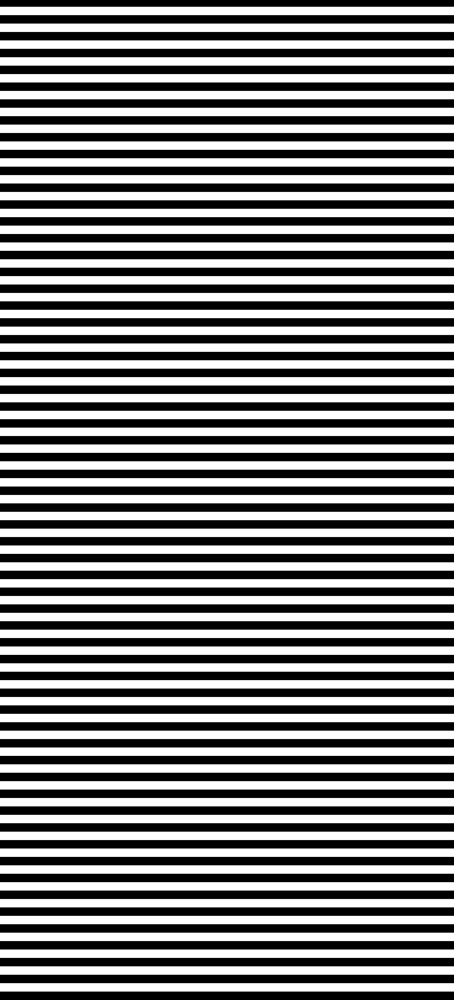

# Zebra Lines BMP Generator

## Overview

The Zebra Lines BMP Generator is a Python application that creates a BMP image with horizontal zebra stripes. The width, height, and stripe height of the image can be customized via command-line arguments.

## Features

- Generates a BMP image with horizontal zebra stripes.
- Customizable image width, height, and stripe height.
- Saves the image with a filename that includes the dimensions and stripe size.

## Installation

1. **Clone or Download the Repository**

   ```bash
   git clone git@github.com:Viewtrix-Technology-Indonesia/zebra-bitmap-generator.git
   cd zebra-bitmap-generator
   ```

2. **Install Dependencies**

    Use pip to install the dependencies listed in requirements.txt:

    ```bash
    pip install -r requirements.txt
    ```

## Usage

You can run the script from the command line and specify the image dimensions and stripe height. The command-line arguments are:

    --width: The width of the image in pixels (default: 1080).
    --height: The height of the image in pixels (default: 2376).
    --size: The height of each zebra stripe in pixels (default: 20).

### Example Commands

1. Generate an 800x600 BMP image with 30-pixel high stripes:

    ```bash
    python main.py --width 800 --height 600 --size 30
    ```

2. Generate the default image (1080x2376 with 20-pixel high stripes):

    ```bash
    python main.py
    ```

### Example Outputs

This is example output for default parameters.



## Contributing

Feel free to fork the repository and submit pull requests. If you encounter any issues or have suggestions, please open an issue on GitHub.
License

This project is licensed under the MIT License - see the LICENSE file for details.